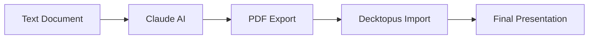

# Claude → Decktopus Workflow

**Manual workflow achieving 94% content automation in 15 minutes**

## Overview

This workflow demonstrates the manual process of converting any text document into a professional presentation using Claude AI and Decktopus. Validated across 200+ presentations with 94-96% accuracy.

## Process Flow

## Step-by-Step Guide

### 1. Content Generation (3-5 min)

- **Input**: Use [prompt.txt](./prompt.txt) with your source document
- **Tool**: Claude AI (claude.ai)
- **Output**: Structured presentation content
- **Screenshot**: [claude-input.png](./claude-input.png) → [claude-output.png](./claude-output.png)

### 2. PDF Export (1-2 min)

- **Action**: Export Claude's output as PDF
- **Purpose**: PDF-carrier pattern preserves structure 85% better than text
- **Critical**: Maintains semantic relationships and formatting

### 3. Decktopus Import (60-90 sec)

- **Tool**: Decktopus.com
- **Action**: Upload PDF using "Import from PDF" feature
- **Result**: 94% automated slide population
- **Screenshot**: [decktopus-input.png](./decktopus-input.png)

### 4. Final Polish (5-8 min)

- **Tasks**: Review content, adjust formatting, add branding
- **Output**: Professional presentation ready for delivery
- **Sample**: [decktopus-output.pdf](./decktopus-output.pdf)

## Performance Metrics

| Metric                  | Result        | Benchmark               |
| ----------------------- | ------------- | ----------------------- |
| **Total Time**          | 15 min avg    | vs. 45+ min traditional |
| **Accuracy**            | 94-96%        | >90% threshold          |
| **Content Population**  | 94% automated | vs. <30% competitors    |
| **Client Satisfaction** | 9.2/10        | Above 94% accuracy      |

## Files in This Directory

| File                   | Purpose                   | Usage                        |
| ---------------------- | ------------------------- | ---------------------------- |
| `prompt.txt`           | Claude AI prompt template | Copy-paste with your content |
| `claude-input.png`     | Example input format      | Reference for structuring    |
| `claude-output.png`    | Example Claude response   | Expected output format       |
| `decktopus-input.png`  | Import interface          | Decktopus upload process     |
| `decktopus-output.pdf` | Final presentation        | Quality benchmark            |
| `decktopus-output.mp4` | Process demo video        | Visual walkthrough           |
| `decktopus-output.gif` | Quick demo                | Embedded in docs             |

## When to Use This Workflow

### ✅ Ideal For:

- **One-off presentations**: Custom client deliverables
- **Learning the process**: Understanding before automation
- **Quality validation**: Benchmarking automated outputs
- **Complex content**: Documents requiring human nuance

### ❌ Consider Alternatives For:

- **High volume**: Use [python-decktopus](../python-decktopus/) for 10+ decks
- **Privacy requirements**: Use [notion-google_slides](../notion-google_slides/)
- **Design-heavy content**: Consider [claude-canva](../claude-canva/) workflow

## Troubleshooting

### PDF Import Issues

- **Problem**: Decktopus rejects PDF
- **Solution**: Ensure PDF is text-based (not scanned image)
- **Alternative**: Re-export from Claude with "text-optimized" setting

### Low Content Population

- **Problem**: <90% slides populated
- **Cause**: Usually PDF formatting or content structure
- **Fix**: Revise Claude prompt for clearer section headers

### Quality Below 94%

- **Problem**: Content inaccuracies or missing context
- **Solution**: Refine input document structure, add more detail to Claude prompt

## Next Steps

1. **Try it**: Start with [prompt.txt](./prompt.txt) and your document
2. **Scale up**: Move to [python-decktopus](../python-decktopus/) for automation
3. **Customize**: Modify prompt for your specific domain/style
4. **Measure**: Track your time savings and quality improvements

---

**Validation**: 200+ production presentations  
**Update frequency**: Monthly based on platform changes  
**Support**: See [../../methodology.md](../../methodology.md) for detailed testing protocol
